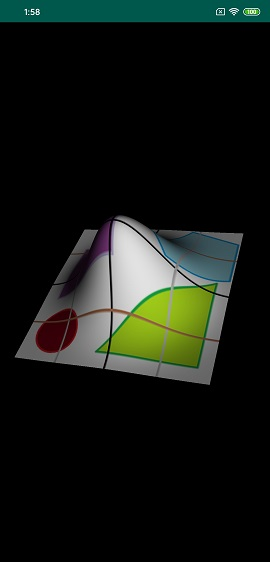

# testOpenGL
a test library for openGL

Meshgrid(TestOPENGL_with_rotation)  
Features:  
(1)Generate meshgrid for texturing x-y plane  
(2)Height data generated and applied to z  
(3)Rotation enabled  
(4)Directional Lighting using Lambert model  
Adding more features...  
  
  
  

    
     

  
Reference:
The LearnOpenGL Tutorial  
